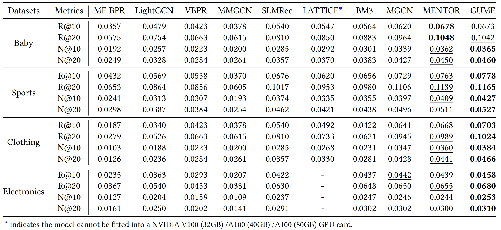

# GUME: Graphs and User Modalities Enhancement for Long-Tail Multimodal Recommendation

<!-- PROJECT LOGO -->

## Introduction

This is the Pytorch implementation for our GUME paper:

>GUME: Graphs and User Modalities Enhancement for Long-Tail Multimodal Recommendation

## Environment Requirement
- python 3.7.11
- Pytorch 1.11.0

## Dataset

We provide four processed datasets: Baby, Sports, Clothing, Electronics.

Download from Google Drive: [Baby/Sports/Clothing/Electronics](https://drive.google.com/drive/folders/1_j7du9KX30S9PwX8jmHlTmhxOof5WTnS?role=writer)

## Training
  ```
  cd ./src
  python main.py
  ```
## Performance Comparison


## Citing GUME
If you find GUME useful in your research, please consider citing our [paper](https://arxiv.org/abs/2407.12338).
```
@article{lin2024gumegraphsusermodalities,
      title={GUME: Graphs and User Modalities Enhancement for Long-Tail Multimodal Recommendation}, 
      author={Guojiao Lin and Zhen Meng and Dongjie Wang and Qingqing Long and Yuanchun Zhou and Meng Xiao},
      year={2024},
      eprint={2407.12338},
      archivePrefix={arXiv},
      primaryClass={cs.IR},
      url={https://arxiv.org/abs/2407.12338}, 
}
```
The code is released for academic research use only. For commercial use, please contact [Guojiao Lin](guojiaolin37@gmail.com).

## Acknowledgement
The structure of this code is  based on [MMRec](https://github.com/enoche/MMRec). Thank for their work.
